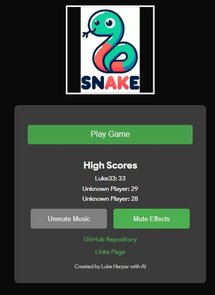

# Snake

A modern, responsive recreation of the classic Snake game — smoother movement, a tighter control feel, and a global leaderboard powered by Cloudflare D1. Deployed entirely on Cloudflare Workers.

**Play it:** https://snake.lukeharper.co.uk



## Features

- Classic Snake gameplay with screen-wrap edges
- Smooth interpolated rendering at a responsive 12 ticks/sec logic rate for a tighter, more modern feel
- Animated snake head (eyes + tongue) and apple-styled food
- Keyboard (Arrow keys / WASD), touch swipe, and Gamepad support (with controller vibration)
- Pause/resume, mute controls for music and sound effects (persisted in `localStorage`)
- PWA support — installable, works offline via a Service Worker
- Global leaderboard backed by Cloudflare D1, with automatic fallback to a local cache if offline
- iOS "Add to Home Screen" prompt

## Tech Stack

- **Frontend:** Vanilla HTML/CSS/JS, Canvas 2D rendering — no build step required
- **Backend:** Cloudflare Worker (`src/worker.js`) serving static assets and a small JSON API
- **Database:** Cloudflare D1 (SQLite) for the leaderboard (`scores` table)
- **Deployment:** Cloudflare Workers, deployed automatically from GitHub via Cloudflare's Git integration

## Project Structure

```
├── public/              # Static assets served by the Worker (HTML, CSS, JS, media, icons)
│   ├── index.html
│   ├── style.css
│   ├── script.js
│   ├── sw.js            # Service worker for offline/PWA support
│   └── ...
├── src/
│   └── worker.js         # Worker entrypoint: serves assets + /api/scores endpoints
├── schema.sql             # D1 database schema
├── wrangler.toml          # Cloudflare Worker configuration
└── package.json
```

## API

- `GET /api/scores` — returns the top 10 scores as JSON: `{ "scores": [{ "name", "score", "created_at" }] }`
- `POST /api/scores` — submits a new score. Body: `{ "name": string, "score": integer }`. Returns the updated top 10.

## Local Development

1. Install dependencies:
   ```
   npm install
   ```
2. Create the local D1 database and apply the schema:
   ```
   npm run db:migrate:local
   ```
3. Run the dev server (serves the Worker + static assets, using a local D1 instance):
   ```
   npm run dev
   ```
4. Open the URL shown in the terminal (typically `http://localhost:8787`).

## Deploying to Cloudflare (first-time setup)

### 1. Create the D1 database

```
npm run db:create
```

This prints a `database_id`. Copy it into `wrangler.toml`, replacing `REPLACE_WITH_YOUR_D1_DATABASE_ID`.

### 2. Apply the schema to the remote database

```
npm run db:migrate:remote
```

### 3. Connect the GitHub repo to Cloudflare Workers

1. Go to the [Cloudflare dashboard](https://dash.cloudflare.com/) → **Workers & Pages** → **Create** → **Workers** → **Import a repository** (or **Connect to Git** on an existing Worker).
2. Select the `snake` GitHub repository and the branch to deploy from (e.g. `main`).
3. Cloudflare will detect `wrangler.toml` automatically — no build command is needed since this is a plain Worker with static assets.
4. Under **Settings → Bindings**, confirm the `DB` binding is pointing at the `snake-scores` D1 database (this is defined in `wrangler.toml`, but double check after the first deploy).
5. Save and deploy. From then on, every push to the connected branch automatically redeploys.

### 4. Custom domain (optional)

In the Worker's **Settings → Domains & Routes**, add your custom domain (e.g. `snake.lukeharper.co.uk`) and follow the DNS instructions provided.

## Notes on Credentials

This project only requires a Cloudflare account connected via the dashboard's Git integration — no API tokens or secret keys are stored in the repository. The D1 database binds directly to the Worker with zero credentials needed in code.
